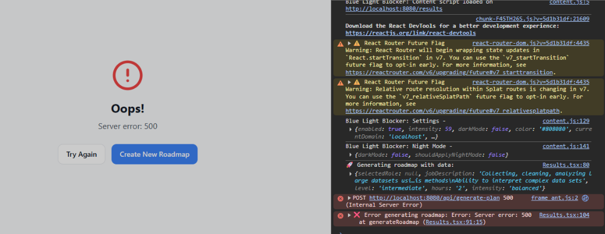

# 🚀 CareerPath - AI-Powered Learning Roadmap & Curriculum Generator

**CareerPath** is a full-stack application that helps users generate personalized career learning plans. It analyzes a specific job description or role and creates a tailored day-by-day study schedule using AI.



## 🌟 Solution & Features

Finding a clear path to a new career is overwhelming. **CareerPath** solves this by acting as your personal AI Career Architect.

*   **🎯 Smart Roadmap Generation**: Generates a structured multi-week learning plan based on your target role, skill level, and daily availability.
*   **🧠 Dynamic Content Engine**: Unlike static templates, the "Learn" page generates **custom study materials** on the fly:
    *   Finds the best YouTube tutorials for each specific topic.
    *   Generates detailed markdown study notes (500+ words).
    *   Creates runnable code examples and practice quizzes.
*   **⚡ Real-Time AI Integration**: Powered by **Google Gemini 2.0 Flash** (via OpenRouter) for fast, high-quality curriculum design.
*   **📊 Progress Tracking**: Track your completion status across modules and visualize your journey.

## 🛠️ Tech Stack

*   **Frontend**: React (Vite), Tailwind CSS, Framer Motion, Lucide Icons
*   **Backend**: Node.js, Express, OpenRouter API
*   **AI**: Google Gemini 2.0 Flash

## 🚀 Getting Started

### Prerequisites

*   Node.js (v18+)
*   An [OpenRouter](https://openrouter.ai/) API Key

### Installation

1.  **Clone the repository:**
    ```bash
    git clone https://github.com/suraj-jd/study.git
    cd study
    ```

2.  **Install dependencies:**
    ```bash
    npm install
    ```

3.  **Configure Environment:**
    Create a `.env` file in the root directory:
    ```env
    OPENROUTER_API_KEY=your_api_key_here
    ```

4.  **Run Development Server:**
    ```bash
    npm run dev
    ```
    The app will start at `http://localhost:5173` (frontend) and `http://localhost:8080` (backend).

## 📸 Screenshots

*(Add more screenshots here)*

## 📄 License

MIT License
